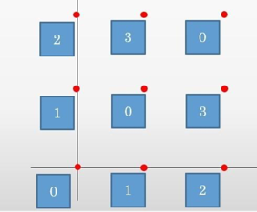

# Task 3. Bright personalities

|                  |        |
|------------------|--------|
| Input filename   | STDIN  |
| Outfile filename | STDOUT |
| Time limit       | 1 s    |
| RAM limit        | 32 MB  |

Who does not know General Gavs? However, few people think about how his grandiose career developed after the fights in
hot spots. He decided to cheat and, on his own orders, appointed himself chief of the military unit in order to live a little
calmer.

The military unit under the command of the legendary (or not so) general showed quite good results before
superiors. This aroused genuine interest among senior management. To check the reality of military indicators
part was sent to Colonel-General Viktorin Yevchuk. Since the letter about the arrival of the auditor was sent by Russian Post,
then General Gavs found out about it only 1 second before the arrival of the check. Of course, he wanted to conduct an IBD (imitation of a violent
activities). The general decided to take as an example of building a "box" n * n (square matrix).

Since each of the wards of General Gavs considered himself a very extraordinary and bright personality, but could not distinguish himself in anything
except for growth, and also did not want to stand out strongly against the background of his colleagues standing with him, then each soldier wanted to become
box so that his height is the smallest possible, but not occupied of all the people standing with him in the same line and
column.

Since the department under the command of General Gavs was still very disorganized, despite the personal and
professional qualities of the brave general, then some soldiers still managed to be late, besides, Gavs decided
personally check the construction of individual especially notorious boobies. Since the time for performing operations is limited (1
second), then the general, due to his advanced age, simply physically does not have time to build. Firstly,
it is necessary to put into operation late fighters. The general looks at the growth of the fighter and suggests a line where one could
would put it. General Gavs' request will look like this:

Find(r,k), where r is the line number where the general wants to put the fighter, and k is the height of the latecomer. It is guaranteed that the answer to
question less than n.

As mentioned earlier, the general knows some especially negligent soldiers by sight, so he wants to check the soldier’s height
at a certain position. It was lucky that General Gavs has an excellent eye, but due to participation in hot spots, he is completely
there was no time to study, so he cannot find a position with the given coordinates. Help him determine what he needs.
growth for the entered position. General Gavs' question would look like this:

Get(r,c), where r is the row number and c is the column number

Due to the fact that a friend of the general named Leon is fond of sports programming, he greatly influenced
worldview of General Gavs, so now he counts numbers from zero in all tables. Moreover, in view of the fact that
the son of Gavs is 1 cm tall, then he took him as a standard and assigned him a height of 0.

## Input file format

The first line of the input contains two integers n and q (1 <= n <= 10^18, 1 <= q <= 10^6) – the size
tables and number of queries. The next q lines contain queries in the above format.

## Output file format

For each query print the found answer.

## Examples

| `input.txt`                                      | `output.txt`           |
|--------------------------------------------------|------------------------|
| <pre>5 3 get 1 1 get 2 1 find 2 0</pre> | <pre>0 3 2</pre> |

## Notes

| Group | Groups needed | Score | Restrictions                          |
|-------|---------------|-------|---------------------------------------|
| 1     | examples      | 25    | 1 <= n, q <= 60                       |
| 2     | 1             | 25    | 1 <= n, q <= 2000 (нет запросов find) |
| 3     | 1, 2          | 25    | 1 <= n, q <= 2000                     |
| 4     | 1, 2, 3       | 25    | 1 <= n <= 10^18, 1 <= q <= 10^6       |

